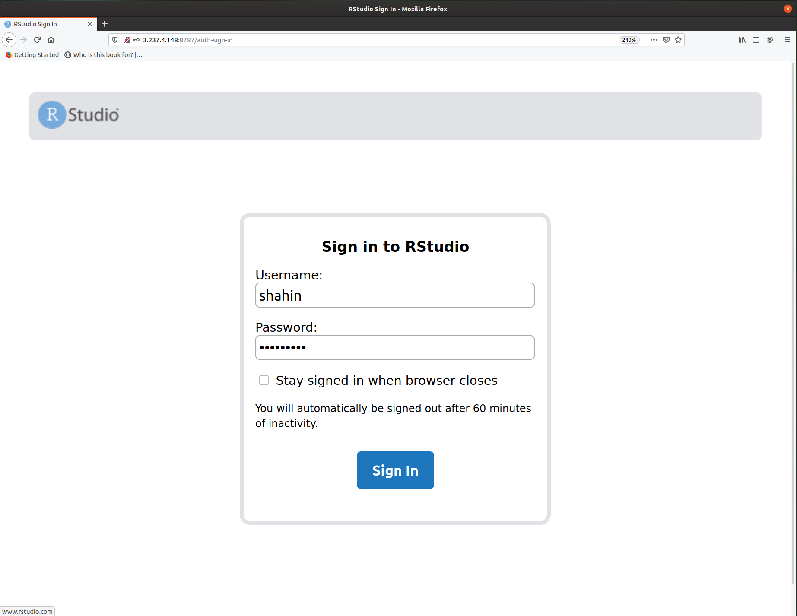
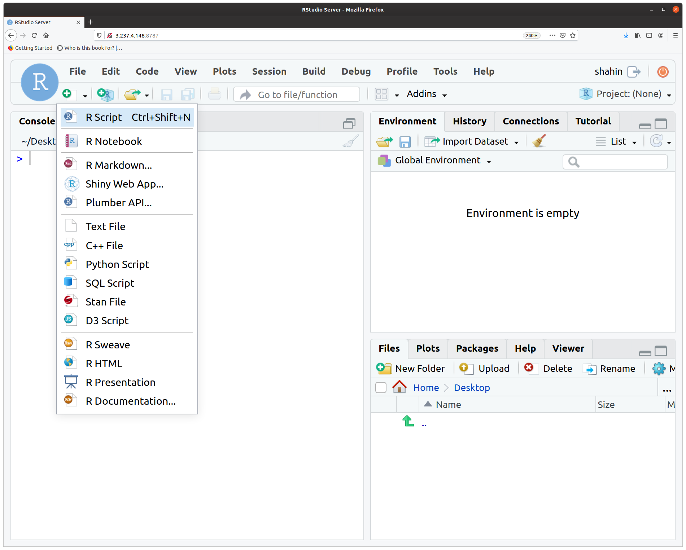
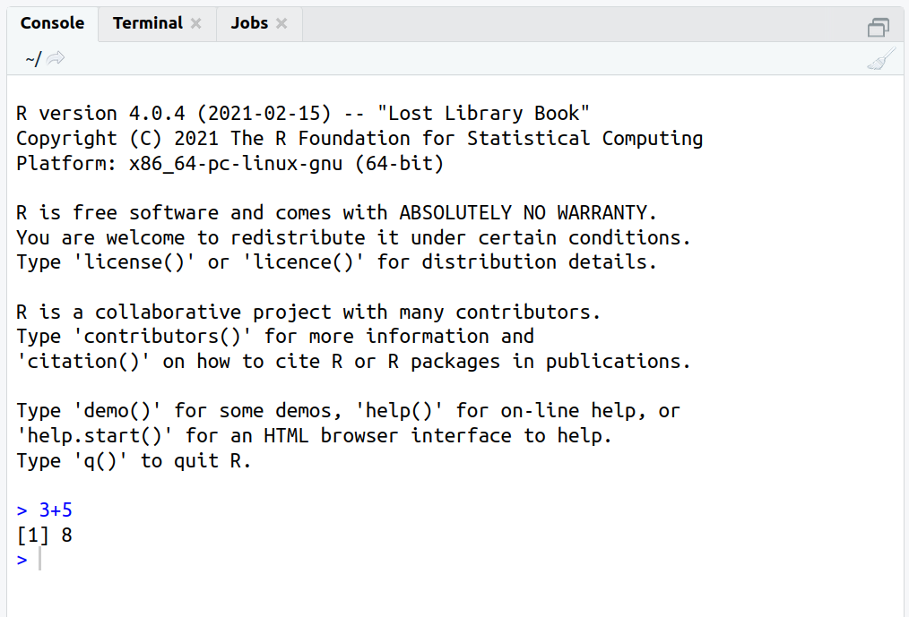
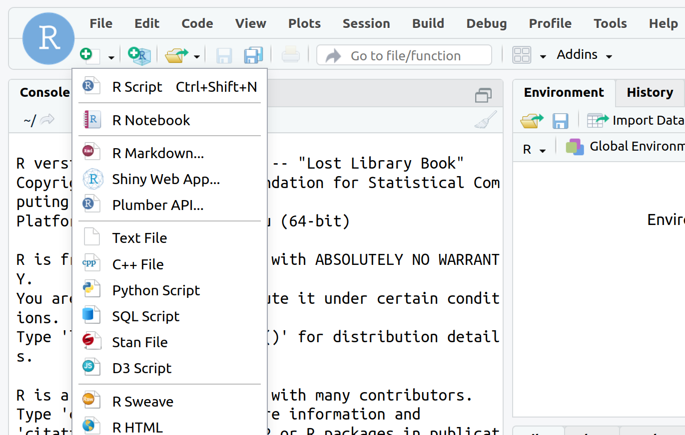
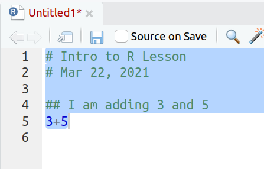
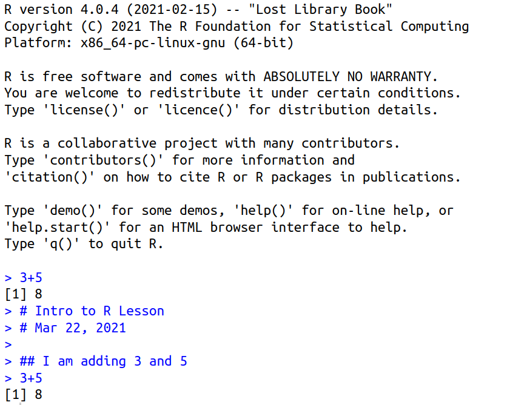

## Learning Objectives

- Describe what R and Rstudio are.
- Interact with R using Rstudio Server
- Get familiar with the Rstudio

## 1. What is R?

R is a freely available programming language and environment used for statistical computing and graphics which provides a wide variety of statistical and graphical techniques: linear and nonlinear modelling, statistical tests, time series analysis, classification, clustering, etc.

The R environment combines:

* effective handling of big data
* collection of integrated tools
* graphical facilities
* simple and effective programming languagei


### 1.1 Why use R?


R is a powerful, extensible environment. It has a wide range of statistics and general data analysis and visualization capabilities.

* Data handling, wrangling, and storage
* Wide array of statistical methods and graphical techniques available
* Easy to install on any platform and use (and it’s free!)
* Open source with a large and growing community of peers


## 2. What is RStudio?

RStudio is freely available open-source Integrated Development Environment (IDE). RStudio provides an environment with many features to make using R easier and is a great alternative to working on R in the terminal. 


* Graphical user interface, not just a command prompt
* Great learning tool 
* Free for academic use
* Platform agnostic
* Open source


### 2.1 Accessing RStudio Server

RStudio is available in two formats: RStudio Desktop is a regular desktop application
you can run on your local computer while RStudio Server runs on a remote server and
allows accessing RStudio using a web browser.

To access the RStudio on the FAES Server:

1. Close your X2Go Session.
2. Open your Web Browser (Chrome, Firefox, etc).
3. Search for: **34.238.117.41:8787**
4. Insert your Username and Password



5. Open a Rscript



### 2.2 RStudio Interface

The unique feature of an IDE is that you can access your terminal
console, file manager, and even more in the same window.

**The RStudio interface has four main panels:**

1. **Console**: where you can type commands and see output. *The console is all you would see if you ran R in the command line without RStudio.*
2. **Script editor**: where you can type out commands and save to file. You can also submit the commands to run in the console.
3. **Environment/History**: environment shows all active objects and history keeps track of all commands run in console
4. **Files/Plots/Packages/Help**

## 3. Organizing your working directory & setting up

### 3.1 Viewing your working directory

let's go back to the Console (R interpreter):

```r
getwd()
```

> **NOTE** Every new programming language has its own commands. `getwd()` is the equivalent of terminal's `pwd`.

Let's go into the *R_data* directory.

```r
setwd("~/Day1/R_data")
```


## 4. Interacting with R

Now that we have our interface and directory structure set up, let's start playing with R! There are **two main ways** of interacting with R in RStudio: using the **console** or by using **script editor** (plain text files that contain your code).

### 4.1 Console window
The **console window** (in RStudio, the bottom left panel) is the place where R is waiting for you to tell it what to do, and where it will show the results of a command.  You can type commands directly into the console, but they will be forgotten when you close the session. 



### 4.2 Script editor

Best practice is to enter the commands in the **script editor**, and save the script.

Open a script in the left upper quadrant of your RStudio session:




**The Rstudio script editor allows you to 'send' the current line or the currently highlighted text to the R console by clicking on the `Run` button in the upper-right hand corner of the script editor**. Alternatively, you can run by simply pressing the `Ctrl` and `Enter` keys at the same time as a shortcut.

Enter the following in your **script editor** and use the comments character `#` to add descriptions and highlighting the text to run:
	
	# Intro to R Lesson
	# Mar 22, 2021

	## I am adding 3 and 5
	3+5

You are encouraged to comment liberally to describe the commands you are running using `#`. This way, you have a complete record of what you did, you can easily show others how you did it and you can do it again later on if needed.


You should see the command run in the console and output the result.



What happens if we do that same command without the comment symbol `#`? Re-run the command after removing the # sign in the front:

```r
I am adding 3 and 5
3+5
```

Now R is trying to run that sentence as a command, and it 
doesn't work. We get an error in the console *"Error: unexpected symbol in "I am" means that the R interpreter did not know what to do with that command."*


### 4.3 Console command prompt

Interpreting the command prompt can help understand when R is ready to accept commands. Below lists the different states of the command prompt and how you can exit a command:

**Console is ready to accept commands**: `>`.

If R is ready to accept commands, the R console shows a `>` prompt. 

When the console receives a command (by directly typing into the console or running from the script editor (`Ctrl-Enter`), R will try to execute it.

After running, the console will show the results and come back with a new `>` prompt to wait for new commands.


**Console is waiting for you to enter more data**: `+`.

If R is still waiting for you to enter more data because it isn't complete yet,
the console will show a `+` prompt. It means that you haven't finished entering
a complete command. Often this can be due to you having not 'closed' a parenthesis or quotation. 

**Escaping a command and getting a new prompt**: `Esc`

If you're in Rstudio and you can't figure out why your command isn't running, you can click inside the console window and press `esc` to escape the command and bring back a new prompt `>`.


---
**Exercise**

1. Try highlighting only `3 +` from your script editor and running it. Find a way to bring back the command prompt `>` in the console.

---

## 5. Interacting with data in R

R is commonly used for handling big data, and so it only makes sense that we learn about R in the context of some kind of relevant data. Let's take a few minutes to add files to the folders we created and familiarize ourselves with the data.

### 5.1 The dataset

R is particularly good for working with large tabular dataset (dataframes). Later in the workshop, we will be able to read such files into R and work the for whatever downstream analysis we need.

 

### 5.2 The metadata

We have another file in which we identify **information about the data** or **metadata**. Our metadata is also stored in a CSV file. In this file, each row corresponds to a sample and each column contains some information about each sample. 

The first column contains the row names, and **note that these are identical to the column names
in our expression data file above** (albeit, in a slightly different order). The next few columns
contain information about our samples that allow us to categorize them. For example, the second
column contains genotype information for each sample. Each sample is classified in one of two
categories: Wt (wild type) or KO (knockout). *What types of categories do you observe in the
remaining columns?*

 

R is particularly good at handling this type of **categorical data**. Rather than simply storing this information as text, the data is represented in a specific data structure which allows the user to sort and manipulate the data in a quick and efficient manner. We will discuss this in more detail as we go through the different lessons in R!  

## Best practices

Before we move on to more complex concepts and getting familiar with the language, we want to point out a few things about best practices when working with R which will help you stay organized in the long run:

* Code and workflow are more reproducible if we can document everything that we do. Our end goal is not just to "do stuff", but to do it in a way that anyone can easily and exactly replicate our workflow and results. **All code should be written in the script editor and saved to file, rather than working in the console.** 
* The **R console** should be mainly used to inspect objects, test a function or get help. 
* Use `#` signs to comment. **Comment liberally** in your R scripts. This will help future you and other collaborators know what each line of code (or code block) was meant to do. Anything to the right of a `#` is ignored by R. *A shortcut for this is `Ctrl + Shift + C` if you want to comment an entire chunk of text.*

---
