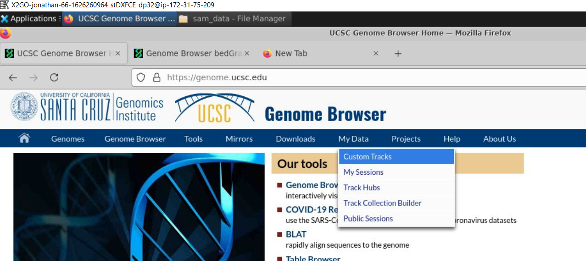
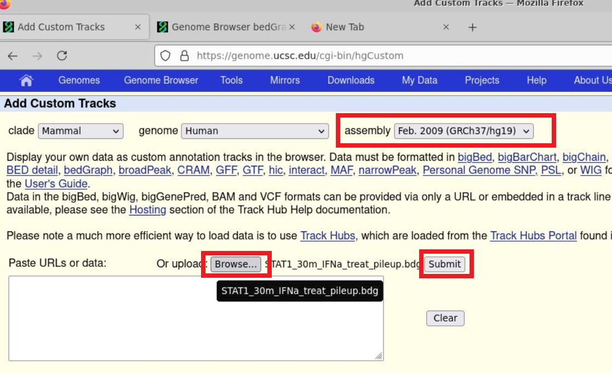
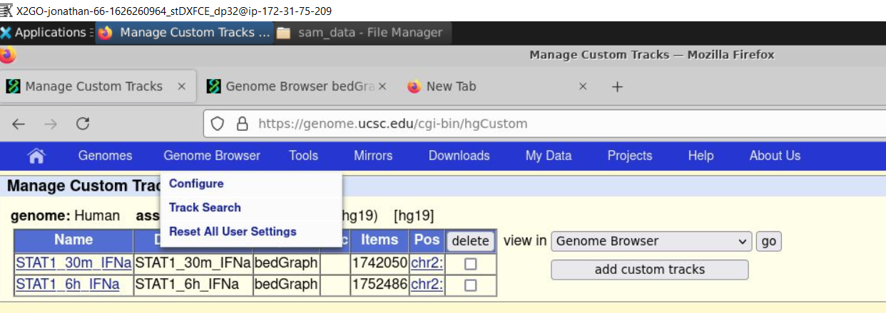
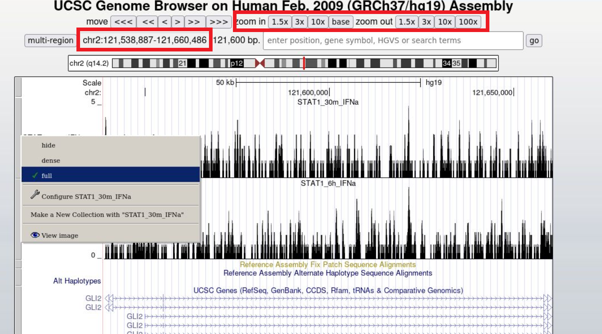

### UCSC genome browser
Now, we want to work with the .bdg files. We need to add metadata to them, so the genome browser can distinguish them. This is a one-liner that does adds the metadata, but you can just manually do this with a text editor.  

```
echo "$(echo 'track type=bedGraph name=STAT1_30m_IFNa' | cat - STAT1_30m_IFNa_treat_pileup.bdg )" > STAT1_30m_IFNa_treat_pileup.bdg 
echo "$(echo 'track type=bedGraph name=STAT1_6h_IFNa' | cat - STAT1_6h_IFNa_treat_pileup.bdg )" > STAT1_6h_IFNa_treat_pileup.bdg 
```
Now, we use the browser in X2Go to upload these bedGraph files to the UCSC genome browser at the url: https://genome.ucsc.edu/. 

#### Step 1: go to custom tracks

#### Step 2: change genome to hg19 and upload tracks

#### Step 3: go to genome browser

#### Step 4: change view to chr2:121,538,887-121,660,486


### Motif discovery

Then, we run bedtools to exclude the common peaks between the two files and obtain the sets of distinct peaks per sample.

```Bash
bedtools subtract -a STAT1_6h_IFNa_peaks.bed -b STAT1_30m_IFNa_peaks.bed > STAT1_6h_IFNa_distinct_peaks.bed
bedtools subtract -a STAT1_30m_IFNa_peaks.bed -b STAT1_6h_IFNa_peaks.bed > STAT1_30m_IFNa_distinct_peaks.bed
```

hg38 is the reference genome, output_1 is the output directory, size is the window for finding motifs (see http://homer.ucsd.edu/homer/ngs/peakMotifs.html), mask is used to ignore repeat sequences, p is for processors, and bg is for background peaks to constrast with  

Lastly, we run the `findMotifsGenome.pl` command to obtain the enriched motifs

```
mkdir output_1 output_2
findMotifsGenome.pl STAT1_30m_IFNa_distinct_peaks.bed hg38 output_1 -size 200 -mask -p 2 -bg STAT1_6h_IFNa_distinct_peaks.bed 
findMotifsGenome.pl STAT1_30m_IFNa_distinct_peaks.bed hg38 output_2 -size 200 -mask -p 2 -bg STAT1_6h_IFNa_distinct_peaks.bed 
```

If you navigate to the output_1 folder, you could find the known and novel Motifs that homer generated in knownResults.html and homerResults.html files respectively.
