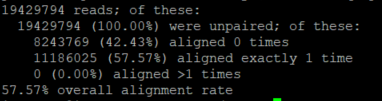
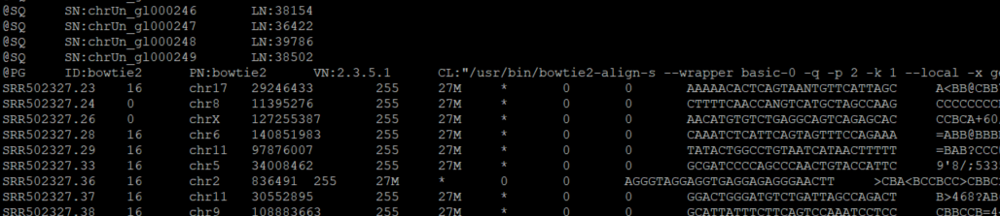
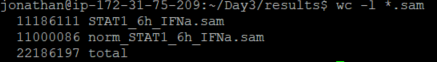
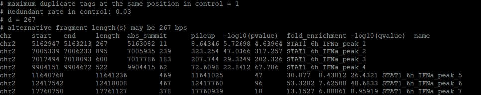

## ChIP-seq experiment description
This is a time course experiment for binding at STAT1 sites across the hg19 genome, but we will only look at aligning the fastq file for one condition (6h INFa treatment). Generally each ChIP-seq experiment has one file measuing the signal and one file measuring the input (cross-linked and sonicated but not immuno-precipitated).

| STAT1  | control |
| ------------- | ------------- |
| STAT1_30m_IFNa.fastq  | INP_30m_IFNa.fastq  |
| STAT1_6h_IFNa.fastq  | INP_6h_IFNa.fastq  |

The other files have been processed as downsampled BAM files. They have already been aligned and processed. We are looking at STAT1_6h_IFNa.fastq
```Bash
cd ~/Day3
mkdir results 
cd raw_data
head STAT1_6h_IFNa.fastq
```
As you can see, we have the fastq standard of four lines per read. These reads are short, so bowtie1 or bwa might be more suitable, but we use bowtie2 because read lengths are generally > 50. 
```
@SRR502327.1 HWI-EAS233:6:1:3:1856 length=27
TTTATCTTGTTNNACCATCCGTACAAT
+SRR502327.1 HWI-EAS233:6:1:3:1856 length=27
BACA=C<,?B(%%<*CB8BCC/C9,A<
```
## Alignment with bowtie2
| arguments  | definition |
| ------------- | ------------- |
| -q  | fastq input file  |
| -p  2 |  2 threads used to do alignment |
| -k  1 | searching for at most one alignment (not optimal)  |
| --local  | local alignment  |
| --no-unal | supress output for records that didn't align | 

```Bash
cd ~/Day3
bowtie2 -q -p 2 -k 1 --local --no-unal -x genome/hg19 raw_data/STAT1_6h_IFNa.fastq > results/STAT1_6h_IFNa.sam
```


Now we have a SAM file and some QC output.



Normally, we would go right ahead and turn it into a bam file, but we need to normalize it. Imagine the sequencing depth of the other experiments is different. If we are looking at the significance of peaks, we need to downsample reads so they are the same between experiments and same between controls. In this case, the STAT1 experiments were downsampled to 11,000,000 reads and the input were downsampled to 19,000,000.



```Bash
cd results
head -n 200 STAT1_6h_IFNa.sam
```
Lets make a script for downsampling reads and getting rid of reads mapped to non-standard chromosomes 
```Bash
#!/bin/bash
# filter out mitochondrial DNA, random chromosomes, clone contigs, other alignments and headers from SAM file STAT1_6h_IFNa.sam
grep -v '^@' STAT1_6h_IFNa.sam | grep -v 'chrM' | grep -v 'random' | grep -v 'chrUn' | grep -v 'XS' > no_header_STAT1_6h_IFNa.sam

# get headers from SAM file STAT1_6h_IFNa.sam
grep @ STAT1_6h_IFNa.sam > header_STAT1_6h_IFNa.sam

# downsample reads to integer argument $2
shuf -n 11000000 no_header_STAT1_6h_IFNa.sam > no_header_11000000_STAT1_6h_IFNa.sam

# append downsampled reads with header
cat header_STAT1_6h_IFNa.sam no_header_11000000_STAT1_6h_IFNa.sam > norm_STAT1_6h_IFNa.sam

# remove temporary files
rm header_STAT1_6h_IFNa.sam
rm no_header_STAT1_6h_IFNa.sam
rm no_header_11000000_STAT1_6h_IFNa.sam
```
```Bash
wc -l *.sam
```


Okay now lets write a script for converting the SAM file to an indexed BAM file using Samtools

```Bash
#!/bin/bash

cd ~/Day3/results
# convert to BAM file
samtools view -b norm_STAT1_6h_IFNa.sam > norm_STAT1_6h_IFNa.bam

# sort by leftmost coordinates (start)
samtools sort norm_STAT1_6h_IFNa.bam > norm_STAT1_6h_IFNa.sorted.bam

# generate index for BAM file
samtools index norm_STAT1_6h_IFNa.sorted.bam

# remove tempoary files
norm_STAT1_6h_IFNa.bam
```
After running this script, we will have a similar type of file to those in ~/Day3/sam_data
```Bash
bash sam_to_bam.sh norm_STAT1_6h_IFNa.sam
```
While we don't do this here, reads can be QC'd by removing duplicates, blacklist regions, and computing the fraction of reads in peaks. 


## Calling peaks with macs 
| arguments  | definition |
| ------------- | ------------- |
| -t | treatment |
| -c | control |
| -n | name |
| --outdir | output directory | 
| -g hs | human species genome |
| --bgd | generate bedGraph files of piled up fragments | 
| -q 0.05 | q-value cutoff | 
| -f BAM | input file type | 
```Bash
cd ../sam_data
macs3 callpeak -t norm_STAT1_30m_IFNa.bam -c norm_INP_30m_IFNa.bam -n STAT1_30m_IFNa --outdir . -g hs --bdg -q 0.05 -f BAM
macs3 callpeak -t norm_STAT1_6h_IFNa.bam -c norm_INP_6h_IFNa.bam -n STAT1_6h_IFNa --outdir . -g hs --bdg -q 0.05 -f BAM
```
Of interest to us are the .xls and .bedGraph files. The .xls files will be converted to BED files, and in the next section, we will show how the bedGraph files can be displayed on the UCSC genome browser. We use the UNIX utility awk to convert the .xls file into BED files. We want to skip all lines that are not of the BED format. 

```Bash
awk '$1 ~ /chr/ {print $1"\t"$2"\t"$3"\t"$10"\t"$7"\t."}' STAT1_30m_IFNa_peaks.xls > STAT1_30m_IFNa_peaks.bed
awk '$1 ~ /chr/ {print $1"\t"$2"\t"$3"\t"$10"\t"$7"\t."}' STAT1_6h_IFNa_peaks.xls > STAT1_6h_IFNa_peaks.bed
```
