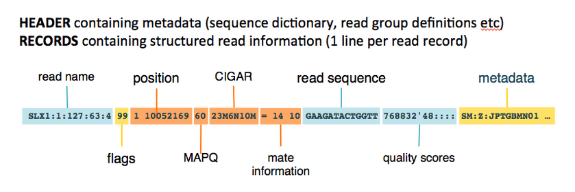
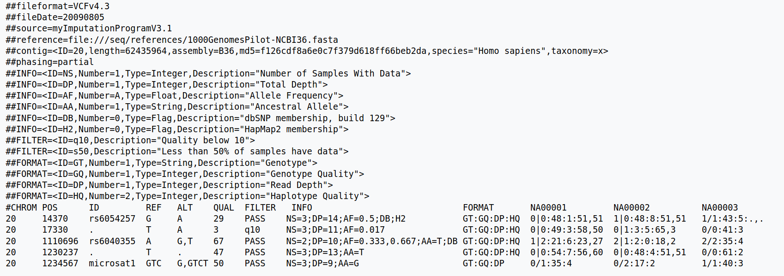

## DNAseq Alignment Review

We introduced the various genomics file formats yesterday. Let's quickly review those:


### File Formats

1. [fasta](https://blast.ncbi.nlm.nih.gov/Blast.cgi?CMD=Web&PAGE_TYPE=BlastDocs&DOC_TYPE=BlastHelp)


2. [fastq](https://support.illumina.com/bulletins/2016/04/fastq-files-explained.html)


3. [SAM/BAM](https://gatk.broadinstitute.org/hc/en-us/articles/360035890791-SAM-or-BAM-or-CRAM-Mapped-sequence-data-formats)



4. [VCF/BCF](https://www.internationalgenome.org/wiki/Analysis/Variant%20Call%20Format/vcf-variant-call-format-version-40/)


### Alignment Steps

1. Index your reference genome

```bash
$ bwa index genome.fa
```

2. Align your raw data

```bash
bwa mem -t $threads $genome $fastq_r1 $fastq_r2 > aln.sam
```

3. Convert (compress) your sam file to bam

```bash
samtools view -b aln.sam > aln.bam
```

4. Sort your bam file

```bash
samtools sort aln.bam > aln.sorted.bam
```

5. mark PCR duplicates (recommended for variant calling)

```bash
PicardCommandLine MarkDuplicates \
	I=aln.sorted.bam \
	O=aln.markdup.sorted.bam \
	M=aln_markdup_metrics.txt
```

6. generate the index

```bash
samtools index aln.markdup.sorted.bam
```

> This generates the index file that ends with `.bai`. You could then view the bam file in IGV.
Make sure the index is present in the same directory.

7. Variant Calling

##### freebayes

```bash
freebayes -f ref.fa aln.markdup.sorted.bam > var.vcf
```

OR

##### bcftools

```bash
bcftools mpileup -Ou -f ref.fa aln.bam | bcftools call -mv -Ob -o var.bcf
bcftools index var.bcf
```

> **NOTE** You can replace `-Ob` with `-Ov` if you want to produce a text file (var.vcf)

OR

##### gatk

```bash
gatk HaplotypeCaller -f ref.fa -I aln.bam -O var.vcf
```

## Create a script

You could use any text editor to write a script that contains all the steps required
for DNAseq analysis

A good option for a text editor is `gedit`. It only works on X2go. We will cover the `vim`
text editor tomorrow morning.

```bash
gedit DNAseq.sh
```
---

```bash
#!/bin/bash

# BIOF045: 03/23/2021
# This script for DNA alignment, sorting, and indexing

## 0. set up the file structure change your directory

cd ~/Day2 


## 1. BWA MEM alignment with 2 threads

bwa mem -t 2 \
	genome/hg38.fa \
	raw_data/ptB_R1.fastq \
	raw_data/ptB_R2.fastq > results/ptB.sam


## 2. Convert sam to bam

samtools view -b results/ptB.sam > results/ptB.bam


## 3. Sort your bam file using samtools

samtools sort results/ptB.bam > results/ptB.sorted.bam


## 4. markduplicates with PICARD

cd results

PicardCommandLine MarkDuplicates \
	I=ptB.sorted.bam \
	O=ptB.markdup.sorted.bam \
	M=ptB_md_metrics.txt


## 5. Index the bam file
###	after this step you could view the bam file in IGV

samtools index ptB.markdup.sorted.bam


## 6. Generate the VCF file using bcftools

bcftools mpileup -f ~/Day2/genome/hg38.fa ptB.markdup.sorted.bam | bcftools call -mv -Ov -o ptB.vcf

## 7. Remove the unneeded files that were generated during the alignment

rm ptA.sam ptB.bam ptB.sorted.bam
```
---

After you create the script, you could run it using `source DNAseq.sh`.
