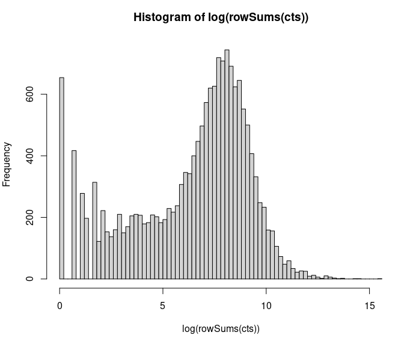
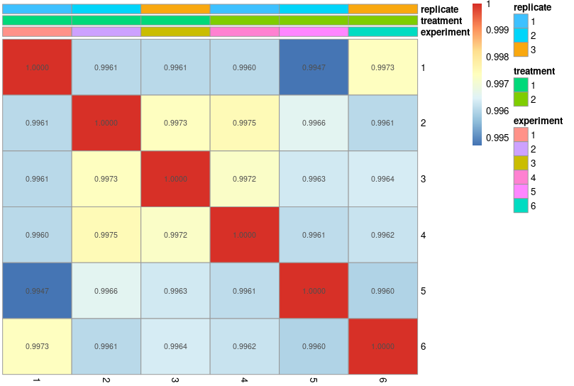
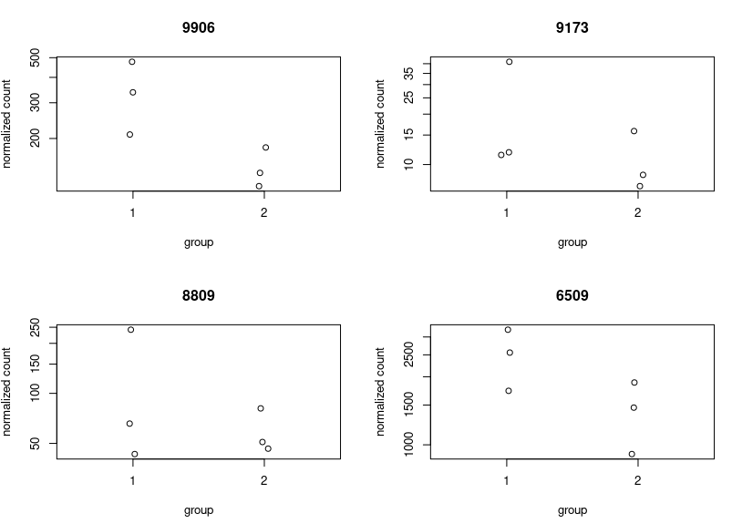
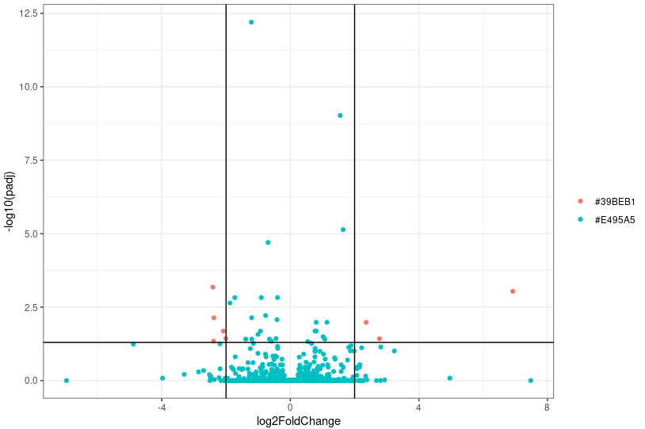
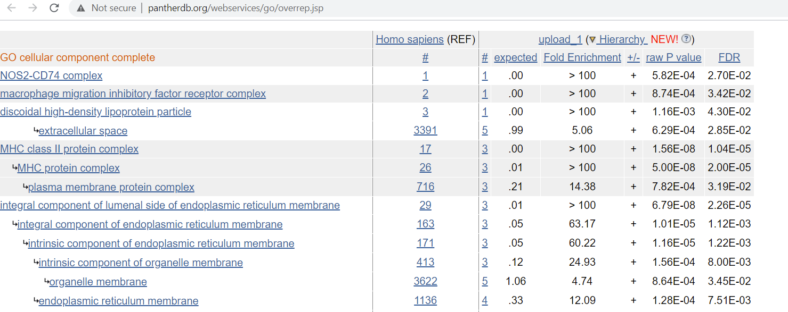

### Analysis of RNA-seq in R

### Reading in a count matrix constructed with `cut` and `paste`
```R
setwd("~/Day4")

# we can see that the first four lines are informative, but are not gene counts 
sample_counts <- read.table("results/combined_count.tsv",sep="\t",header=FALSE)
head(sample_counts)

# we can skip those rows either by reassigning sample_counts to its fifth row or skipping 
# option 1
sample_counts<-sample_counts[5:dim(sample_counts)[1],]
# option 2
sample_counts <- read.table("results/combined_count.tsv",sep="\t",header=FALSE,skip=4)

colnames(sample_counts)<-c("gene","treatment1","control1")
head(sample_counts)
```


### Libraries
```R
library(DESeq2)
library(ggplot2)
library(colorspace)
library(pheatmap)
library(org.Hs.eg.db)
```

### DESeq2
DESeq2 uses the negative binomial distribution to model counts after correcting for between sample variability. 

It requires a counts matrix and a design matrix. 

### Count matrix
Here, we're not working directly with the full count matrix. Instead, we're taking a short-cut and using a publicly avaible count matrix (GSE153311).

As such, it has some extra columns. 
```R
setwd("~/Day4/combined_counts/")
cts <- read.table("counts.tsv",header=TRUE,sep="\t")
colnames(cts)
```
Output
```R
> colnames(cts)
 [1] "st_gene_id"            "gene_id"               "gene_symbol"           "exp_AS1"               "exp_AS2"               "exp_AS3"              
 [7] "exp_NC1"               "exp_NC2"               "exp_NC3"               "read_count_AS1"        "read_count_AS2"        "read_count_AS3"       
[13] "read_count_NC1"        "read_count_NC2"        "read_count_NC3"        "average_exp_AS"        "average_exp_NC"        "average_read_count_AS"
[19] "average_read_count_NC"
```
We want the read counts, as DESeq2 works with count data, so lets select columns
```R
# headers 
exp_headers <- colnames(cts)[4:9]
# row names
row_data <- cts[,2]
# raw count matrix
cts <- round(cts[,10:15])
rownames(cts) <-row_data
```
### Design matrix 
We need to specify where our replicates and treatments/controls are.
```R
# There are six experiments
experiments<-paste0("experiment",seq(6))
# Three replicates per condition
replicates<-rep(paste0("replicate",seq(3)),2)
# Two conditions (
treatment<-c(rep("ASMSCs",3),rep("HDMSCs",3))

meta<-data.frame(matrix(c(experiments,treatment,replicates),6,3))
rownames(meta)<-meta[,1]
colnames(meta)<-c("experiment","treatment","replicate")

meta$experiment<-as.factor(meta$experiment)
meta$treatment<-as.factor(meta$treatment)
meta$replicate<-as.factor(meta$replicate)

meta
```
Output
```R
> meta
             experiment treatment  replicate
experiment1 experiment1    ASMSCs replicate1
experiment2 experiment2    ASMSCs replicate2
experiment3 experiment3    ASMSCs replicate3
experiment4 experiment4    HDMSCs replicate1
experiment5 experiment5    HDMSCs replicate2
experiment6 experiment6    HDMSCs replicate3
```
Not every gene will be high quality and by removing some genes with low counts, we can improve DESeq2's statistical power. 
Here, we filter out some genes. This is a much bigger problem in scRNA-seq where dropout is common. 

First, we look at the distribution of gene counts summed across all experiments. 
```R
hist(log(rowSums(cts)),breaks=100)
quantile(rowSums(cts),probs=c(0.01,0.05,0.10,0.20))
cts <- cts[rowSums(cts)>=36,]
```


Okay, now we load the data into DESeq2. The design of this experiment is pretty simply as we are just comparing two populations. 
But more complex designs could be considered in temporal experiments. e.g. `design= ~ treatment + time`
```R
dds <- DESeqDataSetFromMatrix(countData = cts,
                              colData = meta,
                              design= ~ treatment)
```

We can then run DESeq2 and order the results by adjusted p-value. 
```R
dds <- DESeq(dds)
res <- results(dds,alpha=0.05)
res <- res[order(res$padj),]
head(res)
```
Output, the DESeq2 data structure has 6 columns with each row corresponding to a gene (ENTREZID)
1. baseMean: average normalized count / size factors over all samples
2. log2FoldChange: effect size estimate of treatment
3. lfcSE: standard error estimate of fold change
4. stat: Wald statistic
5. pvalue: Wald test p-value
6. padj: Behnjamini-Hochberg p-value = p-value rank / # of tests * FDR and find largest p-value smaller than critical value
```R
> head(res)
log2 fold change (MLE): treatment 2 vs 1 
Wald test p-value: treatment 2 vs 1 
DataFrame with 6 rows and 6 columns
            baseMean log2FoldChange     lfcSE      stat      pvalue        padj
           <numeric>      <numeric> <numeric> <numeric>   <numeric>   <numeric>
64129       365.5798      -1.212309  0.144442  -8.39306 4.73631e-17 6.31161e-13
4046        832.9958       1.553207  0.210053   7.39437 1.42085e-13 9.46711e-10
3371      11609.6847       1.642778  0.272421   6.03029 1.63662e-09 7.26986e-06
8324       1041.9838      -0.693306  0.119186  -5.81700 5.99134e-09 1.99601e-05
57419       158.1467      -2.411077  0.467300  -5.15959 2.47487e-07 6.59603e-04
101928589    11.1888       6.922034  1.367017   5.06360 4.11405e-07 9.13731e-04
```
The count matrix we have has all ENTREZID and gene symbol, but there is a many-to-one relationship between the two. 
```R
db <- org.Hs.eg.db
columns(db)
```
Output
```R
> columns(db)
 [1] "ACCNUM"       "ALIAS"        "ENSEMBL"      "ENSEMBLPROT"  "ENSEMBLTRANS" "ENTREZID"     "ENZYME"       "EVIDENCE"    
 [9] "EVIDENCEALL"  "GENENAME"     "GO"           "GOALL"        "IPI"          "MAP"          "OMIM"         "ONTOLOGY"    
[17] "ONTOLOGYALL"  "PATH"         "PFAM"         "PMID"         "PROSITE"      "REFSEQ"       "SYMBOL"       "UCSCKG"      
[25] "UNIGENE"      "UNIPROT"  
```
We may want to do some quality controls with the differential gene expression. Common approaches are correlation plots and PCA,
but first, data is often transformed. In this case, the log counts are being used.
1. Correlation plots show us the correlation between batches.
2. PCA is short for principle component analysis. It is a linear dimensionality reduction method that finds principle components 
that maximize variability in one's data and are orthoganal to each other. 

What sort of inference could we draw about this data?

```R
rld <- rlog(dds, blind=FALSE)
plotPCA(rld, intgroup="treatment")
pheatmap(cor(assay(rld),method="spearman"),display_numbers=TRUE,annotation_col=meta,
         number_format='%.4f',cluster_rows=FALSE,cluster_cols=FALSE)
```




We likely want to see how some genes of interest are expressed between treatment and control. Below, we plot four genes
in a 2x2 plot. 
```R
par(mfrow=c(2,2))
plotCounts(dds,gene=mapIds(db,keys="SLC35E2A",column="ENTREZID",keytype="SYMBOL"),intgroup="treatment",main="SLC35E2A")
plotCounts(dds,gene=mapIds(db,keys="IL1RL1",column="ENTREZID",keytype="SYMBOL"),intgroup="treatment",main="IL1RL1")
plotCounts(dds,gene=mapIds(db,keys="IL18R1",column="ENTREZID",keytype="SYMBOL"),intgroup="treatment",main="IL18R1")
plotCounts(dds,gene=mapIds(db,keys="SLC1A4",column="ENTREZID",keytype="SYMBOL"),intgroup="treatment",main="SLC1A4")
par(mfrow=c(1,1))
```


Another common approach for visaulization is to use a volcano plot where fold change is on the x-axis and adjusted p-value is
on the y-axis. 

Here, we define some threshold for adjusted p-value and fold change where we want to color those points differently.

Next, we get colors from the rainbow spectrum.

We load our data into ggplot except for genes that had no p-value computed (due to a failed adjustment).

Finally, we plot data as a scatter `geom_point()` and add two vertical lines `geom_vline()` and a horizontal line `geom_hline()`

```R
threshold <- as.numeric((res$padj<0.05) & (abs(res$log2FoldChange))>2) + 1 
volc_colors <- rainbow_hcl(2)
g<-ggplot(data.frame(res[!is.na(res$padj),]),aes(x=log2FoldChange,y=-log10(padj),colour=volc_colors[threshold[!is.na(res$padj)]]))
g+geom_point()+geom_vline(xintercept = -2)+geom_vline(xintercept = 2)+geom_hline(yintercept = abs(log10(0.05)))+theme_bw()+labs(color="")

```


### Pathway enrichment 

We previously plotted a heatmap showing correlations between batches, but we can also use a heatmap to show the difference
in expression between experiments. By doing this, we can curate a set of genes that have similar expression patterns across 
experiments and then we can look at what pathways are enriched by the genes. 

Here, we define a function that will accept an ENTREZID and output a gene symbol. 

We then find the top 20 most variable genes.

```
findGene <- function(x) {
    return(tryCatch(mapIds(db,keys=as.character(x),column="SYMBOL",keytype="ENTREZID"), error=function(e) NULL))
}

topVarGenes <- head(order(-rowVars(assay(rld))),20)
mat <- assay(rld)[ topVarGenes, ]
mat <- mat - rowMeans(mat)
rownames(mat)<-sapply(rownames(mat),findGene)
pheatmap(mat,annotation_col=meta,cluster_rows=FALSE,cluster_cols=FALSE)
```


One way to find enriched pathways is by compiling a list of genes and then using a browser ontology to find important genes. e.g. querying the genes in GO and finding the resulting pathways with the PANTHAR database. 

 
