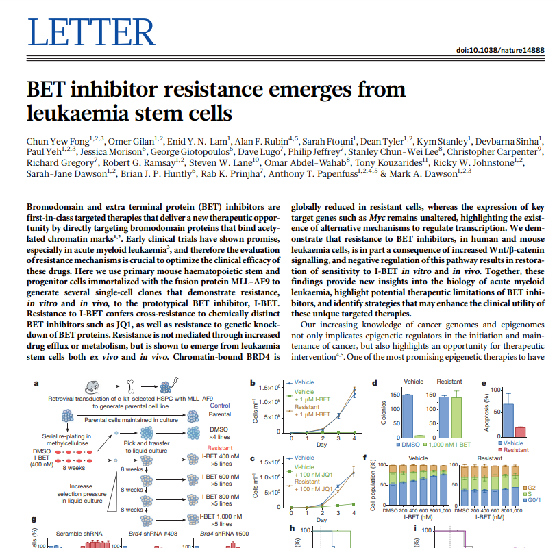

# DGE Review



Here, we will be reviewing the commands we did before, but we will be using a cleaner data set that looks at how BET inhibition affects cancer cells. 

## Data

### Libraries 
```R
# load in the libraries
library(DESeq2)
library(ggplot2)
library(colorspace)
library(pheatmap)
library(tidyverse)
```
### Read in the data
```R
setwd("~/Day5/combined_counts/")
counts <- read.table("counts2.tsv",header=TRUE,sep="\t",row.names=1)
metadata <- read.table("metadata2.csv",sep=",",header=TRUE,row.names=1)
```
### Look at distribution
```R
hist(log(rowSums(counts)),breaks=100)
quantile(rowSums(counts),probs=c(0.01,0.05,0.10,0.50))
counts_filtered <- counts[rowSums(counts)>=10,]
```

### Load data in DESeq2 with appropriate design 
```R
> dds <- DESeqDataSetFromMatrix(countData = counts,
				colData = metadata,
				design= ~ treatment)
```

### Run DESeq2
```R
dds <- DESeq(dds)
res <- results(dds)
res_ordered <- res[order(res$padj),]
```

### Transform data for quality control
```R
rld <- rlog(dds, blind=FALSE)
plotPCA(rld, intgroup="treatment")

colnames(rld) <- rownames(metadata)
pheatmap(cor(assay(rld),method="spearman"),display_numbers=TRUE,annotation_col=metadata,
         number_format='%.4f',cluster_rows=FALSE,cluster_cols=FALSE)
```

### Evaluate some genes related to BET and cancer
Note that we have made it simpler for all of you, so you don't have to query the data base to find gene names. In reality however you will need to make a conversion between gene name formats. Also, this is mouse data, so if one were to `mapIds`, one would have to load db as `db <- org.Mm.eg.db`. See https://bioconductor.org/packages/release/data/annotation/html/org.Mm.eg.db.html for installation. The suffix number `_#`, so don't worry.
```R
par(mfrow=c(2,2))
plotCounts(dds,gene="Apc_37324",intgroup="treatment",main="Apc")
plotCounts(dds,gene="Brd4_35665",intgroup="treatment",main="BRD4")
plotCounts(dds,gene="Myc_33094",intgroup="treatment",main="MYC")
plotCounts(dds,gene="Pms2_14724",intgroup="treatment",main="PMS2")
par(mfrow=c(1,1))
```

### Volcano plot 
```R
volcano_plot_colors <- rainbow_hcl(2)
names(volcano_plot_colors)<-c("hi","bi")
threshold <- as.numeric((res$padj<0.05) & (abs(res$log2FoldChange))>2) + 1 

g<-ggplot(data.frame(res[!is.na(res$padj),]),
          aes(x=log2FoldChange,y=-log10(padj),colour=volcano_plot_colors[threshold[!is.na(res$padj)]]))

g<-g+geom_point()+geom_vline(xintercept = -2)+geom_vline(xintercept = 2)+geom_hline(yintercept = abs(log10(0.05)))+theme_classic()
g+labs(color=c("Significance"))+scale_color_manual(labels = c("sig", "not sig"), values = c("#E495A5","#39BEB1"))
```

### Most variable genes
```R
topVarGenes <- head(order(-rowVars(assay(rld))),20)
mat <- assay(rld)[ topVarGenes, ]
mat <- mat - rowMeans(mat)
rownames(mat)<-sapply(rownames(mat),findGene)
pheatmap(mat,annotation_col=design,cluster_rows=FALSE,cluster_cols=FALSE)
```
