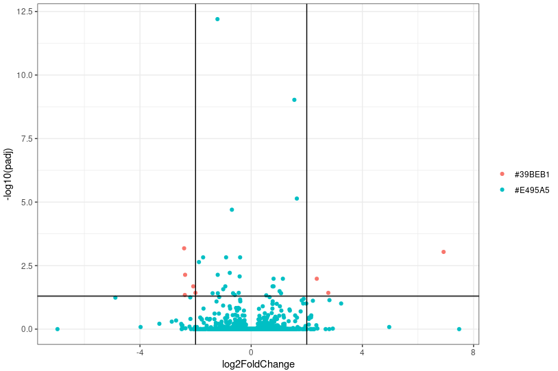
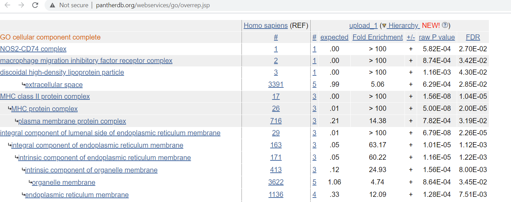

### Analysis of RNA-seq in R using DESeq2

For RNAseq data normalization and analysis, we will be using the
[DESeq2](http://bioconductor.org/packages/devel/bioc/vignettes/DESeq2/inst/doc/DESeq2.html)
library.

### Read in the combined count matrix

```R
# load in the libraries
library(DESeq2)
library(ggplot2)
library(colorspace)
library(pheatmap)
library(tidyverse)
library(EnhancedVolcano)
```

### Count matrix
Let's read the count matrix

```R
# Read the count matrix and the metadata
> setwd("~/Day3/combined_counts/")
> counts <- read.table("counts.tsv", sep = "\t", header = TRUE, row.names = 1)
> metadata <- read.table("metadata.tsv", sep = "\t", header = TRUE, row.names = 1)
```
*NOTE: rownames of your metadata must match the colnames of your counts matrix*

Then look at the content of each dataframe

```R
> View(counts)
> View(metadata)
```

The metadata dataframe specifies what experiments' treatments/controls are.


DESeq is the most commonly used package for analyzing bulk RNAseq data. You can find the manual for DESeq2 [here](http://www.bioconductor.org/packages/release/bioc/vignettes/DESeq2/inst/doc/DESeq2.html).
We can improve DESeq2's statistical power by filtering reads that have a low count number across our samples. This is a much bigger problem in scRNA-seq, though it is useful for bulk RNA seq as well.

First, we look at the distribution of gene counts summed across all experiments. 
```R
# filter out the genes that have low total count across all samples
> rowSums(counts) %>% log() %>% hist(breaks=100)
> rowSums(counts) %>% quantile(probs=c(0.01,0.05,0.10,0.20))
> counts_filtered <- filter(counts, rowSums(counts) >= 36)
```


Okay, now we load the data into DESeq2. The design of this experiment is pretty simply as we are just comparing two populations. 

```R
# Generate the dds object (DESeq uses this format)
> dds <- DESeqDataSetFromMatrix(countData = counts_filtered,
				colData = metadata,
				design= ~ treatment)
```

We can then run DESeq2 and order the results by adjusted p-value. 

```R
# Run differential expression analysis
> dds <- DESeq(dds)
# Use FDR of 0.05
> res <- results(dds, alpha = 0.05)
> res_ordered <- res[order(res$padj),]
# Let's view the top 20 most differentially expressed genes
```

Output, the DESeq2 data structure has 6 columns with each row corresponding to a gene (ENTREZID)
1. baseMean: average normalized count / size factors over all samples
2. log2FoldChange: effect size estimate of treatment
3. lfcSE: standard error estimate of fold change
4. stat: Wald statistic
5. pvalue: Wald test p-value
6. padj: Behnjamini-Hochberg p-value = p-value rank / # of tests * FDR and find largest p-value smaller than critical value

```R
> head(res_ordered, n=6)
log2 fold change (MLE): treatment HDMSCs vs ASMSCs 
Wald test p-value: treatment HDMSCs vs ASMSCs 
DataFrame with 6 rows and 6 columns
               baseMean log2FoldChange     lfcSE      stat      pvalue   padj
              <numeric>      <numeric> <numeric> <numeric>   <numeric>   <numeric>
TINAGL1        365.5798      -1.212309  0.144442  -8.39306 4.73631e-17 6.43665e-13
LSP1           832.9958       1.553207  0.210053   7.39437 1.42085e-13 9.65466e-10
TNC          11609.6847       1.642778  0.272421   6.03029 1.63662e-09 7.41388e-06
FZD7          1041.9838      -0.693306  0.119186  -5.81700 5.99134e-09 2.03556e-05
SLC24A3        158.1467      -2.411077  0.467300  -5.15959 2.47487e-07 6.72670e-04
LOC101928589    11.1888       6.922034  1.367017   5.06360 4.11405e-07 9.31833e-04
```

We will use the following methods for generating a PCA plot. PCA is short for
principle component analysis. It is used to reduce the dimensions of our matrix.


```R
> rld <- rlog(dds, blind=FALSE)
> plotPCA(rld, intgroup="treatment")
```


We likely want to see how some genes of interest are expressed between treatment and control. Below, we plot four genes
in a 2x2 plot. 

```R
par(mfrow=c(2,2))
plotCounts(dds,gene="FZD7",intgroup="treatment",main="FZD7")
plotCounts(dds,gene="IL1RL1",intgroup="treatment",main="IL1RL1")
plotCounts(dds,gene="IL18R1",intgroup="treatment",main="IL18R1")
plotCounts(dds,gene="SLC1A4",intgroup="treatment",main="SLC1A4")
```


Another common approach for visaulization is to use a volcano plot where fold change is on the x-axis and adjusted p-value is
on the y-axis. 

Here, we define some threshold for adjusted p-value and fold change where we want to color those points differently.

The simplest way to create a volcano plot is by using the EnhancedVolcano package in R. However, you could also use other methods such as ggplot which allow for more customization.


```R
EnhancedVolcano(res,
		lab = rownames(res),
		x = 'log2FoldChange',
		y = 'pvalue')
```



### Heatmaps and Pathway enrichment 

We previously plotted a heatmap showing correlations between batches, but we can also use a heatmap to show the difference
in expression between experiments. By doing this, we can curate a set of genes that have similar expression patterns across 
experiments and then we can look at what pathways are enriched by the genes. 

We will generate a heatmap of the top 20 most expressed genes (NOT differentially expresesd)
```R
# create a heatmap of the top 20 most expressed genes
> select <- order(rowMeans(counts(dds,normalized=TRUE)),
                decreasing=TRUE)[1:20]
> pheatmap(assay(rld)[select,], cluster_rows=FALSE, show_rownames=FALSE,
         cluster_cols=FALSE, annotation_col=metadata)
```

We then find the top 20 most variable genes across all 6 samples.
```
> topVarGenes <- head(order(-rowVars(assay(rld))),20)
> mat <- assay(rld[topVarGenes])
> mat <- mat - rowMeans(mat)
> pheatmap(mat,annotation_col=metadata,cluster_rows=FALSE, show_rownames=FALSE,
	cluster_cols=FALSE)
```

Then we find the most differentially expressed genes across the two groups and generate our heatmap using those
```
## Create a heatmap of most differentially expressed genes
> topDiffGenes <- rownames(res_ordered)[1:20]
> mat <- assay(rld[topDiffGenes])
> mat <- mat - rowMeans(mat)
> pheatmap(mat,annotation_col=metadata,cluster_rows=FALSE, show_rownames=FALSE,
	cluster_cols=FALSE)
```


Also, we could generate a correlation plot:
```
## Correlation plot
> pheatmap(cor(assay(rld), method="spearman"),
         annotation_col=metadata,
         cluster_rows=FALSE,
         cluster_cols=FALSE,
         number_format='%.4f',
         display_numbers=TRUE)

```


For a more advanced tutorial for DESeq2, I recommend following [this tutorial](http://dputhier.github.io/jgb71e-polytech-bioinfo-app/practical/rna-seq_R/rnaseq_diff_Snf2.html)

One way to find enriched pathways is by compiling a list of genes and then using a browser ontology to find important genes. e.g. querying the genes in GO and finding the resulting pathways with the PANTHER database. 




---
