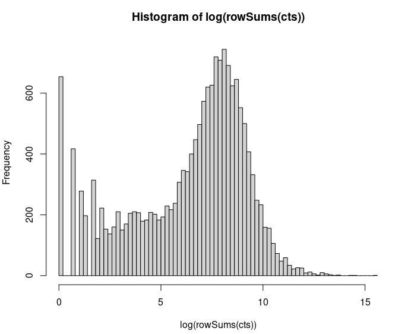
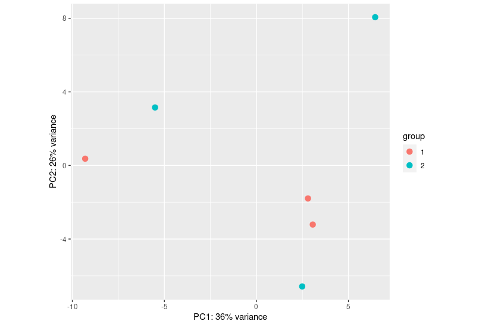
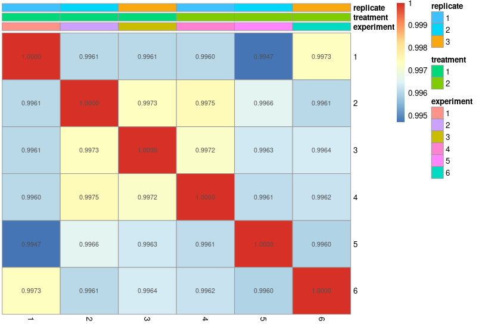
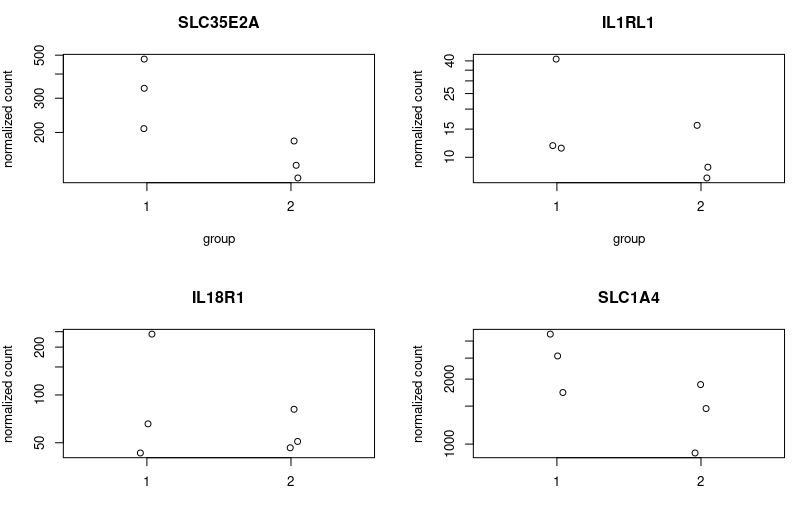
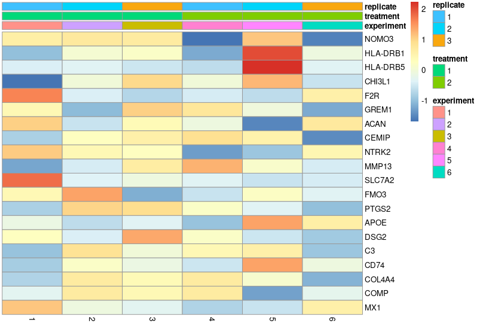

### Analysis of RNA-seq in R

### Read in the combined count matrix

```R
# load in the libraries
library(DESeq2)
library(ggplot2)
library(colorspace)
library(pheatmap)
library(tidyverse)
```

### Count matrix
Let's read the count matrix

```R
# Read the count matrix and the metadata
> setwd("~/Day4/combined_counts/")

> counts <- read.table("counts.tsv")
> metadata <- read.table("metadata.tsv")
```

Then look at the content of each dataframe

```R
> View(counts)
> View(metadata)
```

The metadata dataframe specifies what experiments' treatments/controls are.


DESeq is the most commonly used package for analyzing bulk RNAseq data. You can find the manual for DESeq2 [here](http://www.bioconductor.org/packages/release/bioc/vignettes/DESeq2/inst/doc/DESeq2.html).
We can improve DESeq2's statistical power by filtering reads that have a low count number across our samples. This is a much bigger problem in scRNA-seq, though it is useful for bulk RNA seq as well.

First, we look at the distribution of gene counts summed across all experiments. 
```R
> rowSums(counts) %>% log() %>% hist(breaks=100)
> rowSums(counts) %>% quantile(probs=c(0.01,0.05,0.10,0.20))
> filter(counts, rowSums(counts) >= 36)
```



Okay, now we load the data into DESeq2. The design of this experiment is pretty simply as we are just comparing two populations. 

```R
> dds <- DESeqDataSetFromMatrix(countData = counts,
				colData = metadata,
				design= ~ treatment)
```

We can then run DESeq2 and order the results by adjusted p-value. 
```R
> dds <- DESeq(dds)
> res <- results(dds)
> res_ordered <- res[order(res$padj),]
```
Output, the DESeq2 data structure has 6 columns with each row corresponding to a gene (ENTREZID)
1. baseMean: average normalized count / size factors over all samples
2. log2FoldChange: effect size estimate of treatment
3. lfcSE: standard error estimate of fold change
4. stat: Wald statistic
5. pvalue: Wald test p-value
6. padj: Behnjamini-Hochberg p-value = p-value rank / # of tests * FDR and find largest p-value smaller than critical value
```R
> head(res_ordered)
log2 fold change (MLE): treatment HDMSCs vs ASMSCs 
Wald test p-value: treatment HDMSCs vs ASMSCs 
DataFrame with 6 rows and 6 columns
               baseMean log2FoldChange     lfcSE      stat      pvalue   padj
              <numeric>      <numeric> <numeric> <numeric>   <numeric>   <numeric>
TINAGL1        365.4526      -1.212556  0.146521  -8.27564 1.27770e-16 1.95514e-12
LSP1           832.6578       1.552957  0.209827   7.40112 1.35039e-13 1.03318e-09
TNC          11605.3246       1.642639  0.271256   6.05568 1.39829e-09 7.13220e-06
FZD7          1041.6149      -0.693511  0.121739  -5.69672 1.22133e-08 4.67218e-05
SLC24A3        158.1114      -2.411408  0.459737  -5.24519 1.56118e-07 4.77784e-04
LOC101928589    11.1834       6.921775  1.360641   5.08714 3.63498e-07 9.27040e-04

```

We will use the following methods for visualizing the data by experiment:
1. Correlation plots show us the correlation between batches.
2. PCA is short for principle component analysis. It is used to reduce the dimensions of our matrix.


```R
rld <- rlog(dds, blind=FALSE)
plotPCA(rld, intgroup="treatment")
pheatmap(cor(assay(rld),method="spearman"),display_numbers=TRUE,annotation_col=meta,
         number_format='%.4f',cluster_rows=FALSE,cluster_cols=FALSE)
```




We likely want to see how some genes of interest are expressed between treatment and control. Below, we plot four genes
in a 2x2 plot. 
```R
par(mfrow=c(2,2))
plotCounts(dds,gene="FZD7",intgroup="treatment",main="FZD7")
plotCounts(dds,gene="IL1RL1",intgroup="treatment",main="IL1RL1")
plotCounts(dds,gene="IL18R1",intgroup="treatment",main="IL18R1")
plotCounts(dds,gene="SLC1A4",intgroup="treatment",main="SLC1A4")
```


Another common approach for visaulization is to use a volcano plot where fold change is on the x-axis and adjusted p-value is
on the y-axis. 

Here, we define some threshold for adjusted p-value and fold change where we want to color those points differently.

Next, we get colors from the rainbow spectrum.

We load our data into ggplot except for genes that had no p-value computed (due to a failed adjustment).

Finally, we plot data as a scatter `geom_point()` and add two vertical lines `geom_vline()` and a horizontal line `geom_hline()`

```R
threshold <- as.numeric((res$padj<0.05) & (abs(res$log2FoldChange))>2) + 1 
volc_colors <- rainbow_hcl(2)
g<-ggplot(data.frame(res[!is.na(res$padj),]),aes(x=log2FoldChange,y=-log10(padj),colour=volc_colors[threshold[!is.na(res$padj)]]))
g+geom_point()+geom_vline(xintercept = -2)+geom_vline(xintercept = 2)+geom_hline(yintercept = abs(log10(0.05)))+theme_bw()+labs(color="")

```


### Pathway enrichment 

We previously plotted a heatmap showing correlations between batches, but we can also use a heatmap to show the difference
in expression between experiments. By doing this, we can curate a set of genes that have similar expression patterns across 
experiments and then we can look at what pathways are enriched by the genes. 

We then find the top 20 most variable genes.

topVarGenes <- head(order(-rowVars(assay(rld))),20)
mat <- assay(rld)[ topVarGenes, ]
mat <- mat - rowMeans(mat)
pheatmap(mat,annotation_col=meta,cluster_rows=FALSE,cluster_cols=FALSE)
```


One way to find enriched pathways is by compiling a list of genes and then using a browser ontology to find important genes. e.g. querying the genes in GO and finding the resulting pathways with the PANTHER database. 

 
