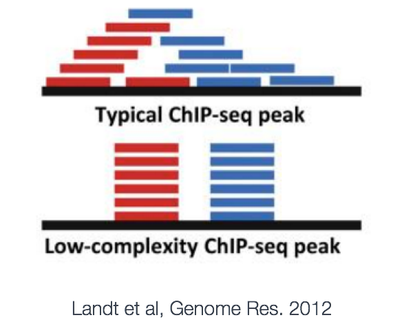

# ChIP-seq analysis 
We are working with the same data as before. 

### Alignment (DO NOT RUN)
We are performing a local alignment to get better contiguous alignments between our reads and the genome

Arguments for bowtie2
```
-q (fastq input)
-p 2 (multiprocessing)
-k 1 find first alignment (suboptimal but fast)
--no-unal ignore unaligned reads
-x genome/hg19 genome location
-X The maximum fragment length for valid paired-end alignments (not included)
```
Code 
```Bash
bowtie2 -q -p 2 -k 1 --local --no-unal -x genome/hg19 raw_data/STAT1_6h_IFNa.fastq > results/STAT1_6h_IFNa.sam
```

### Read normalization (DO NOT RUN)
When comparing peak sets, we want the comparison to be fair, to have started from a shared baseline. This is why it's important to downsample reads. 
The reads in the counts for the TFs must be the same as each other, and the reads in the input controls must be the same.


Duplicates only need to be removed if there is a lot of low quality reads (nonredundant fraction is high).  Otherwise, you may be removing some of your signal.

I showed you a script you could write for normalizing reads. The script takes in two arguments, the SAM file and the number of reads to downsample to. 

Note that permissions sometimes have to be changed to run scripts; `chmod 777 normalize_sam` should work. The above command would downsample STAT1_30m_IFNa.sam to 11M reads. 

These downsampled SAM files could then be sorted and indexed in another script:
```Bash
# get the base name of the SAM file
baseSam=basename $1 .sam

# convert to BAM, sort, and index
samtools view -b $1 > tmp
samtools sort tmp > $baseSam.bam
samtools index $baseSam.bam
```
After saving this as `samToBam.sh`, it could be run like this:
```
./samToBam norm_STAT1_30m_IFNa.sam
```
Remember that permissions need to be changed in some cases. 

### Peak calling (Run again)
Finally we covered peak calling with MACS3, which uses multiple Possion models to model counts across the genome.

Arguments for MACS3
```
# -t treatment
# -c control
# -n name prefix
# --outdir output directory
# -g human sample
# --bdg generate bedGraph
```

Commands for MACS3 
```Bash
macs3 callpeak -t norm_STAT1_30m_IFNa.bam -c norm_INP_30m_IFNa.bam -n STAT1_30m_IFNa --outdir . -g hs --bdg -q 0.05 -f BAM
macs3 callpeak -t norm_STAT1_6h_IFNa.bam -c norm_INP_6h_IFNa.bam -n STAT1_6h_IFNa --outdir . -g hs --bdg -q 0.05 -f BAM
```
MACS3 generates various peak sets, summit sets, and bedGraph files. What we are after is the `*.xls` files as they have the peaks, but they also have some junk at the beginning, so we use `awk` to skip the first 30 lines and select 6 columns in a specification that HOMER wants. 
```Bash
awk 'FNR > 30 { print $1"\t"$2"\t"$3"\t"$10"\t"$7"\t."}' STAT1_6h_IFNa_peaks.xls > STAT1_6h_IFNa_peaks.bed
awk 'FNR > 30 { print $1"\t"$2"\t"$3"\t"$10"\t"$7"\t."}' STAT1_30m_IFNa_peaks.xls > STAT1_30m_IFNa_peaks.bed
```
Next, we need to install HOMER's genome to the path, create some output directories, and run a HOMER command to find genomes
hg38 is the reference genome, output_1 is the output directory, size is the window for finding motifs (see http://homer.ucsd.edu/homer/ngs/peakMotifs.html), mask is used to ignore repeat sequences, p is for processors, and bg is for background peaks to constrast with  

```
PATH=~/homer/:$PATH
mkdir -p output_1 output_2
findMotifsGenome.pl STAT1_30m_IFNa_distinct_peaks.bed hg38 output_1 -size 200 -mask -p 2 -bg STAT1_6h_IFNa_distinct_peaks.bed 
findMotifsGenome.pl STAT1_30m_IFNa_distinct_peaks.bed hg38 output_2 -size 200 -mask -p 2 -bg STAT1_6h_IFNa_distinct_peaks.bed 
```
